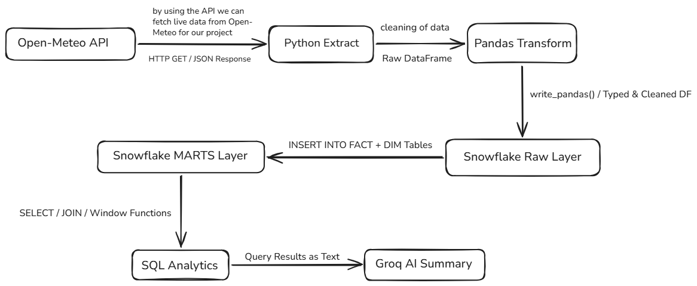
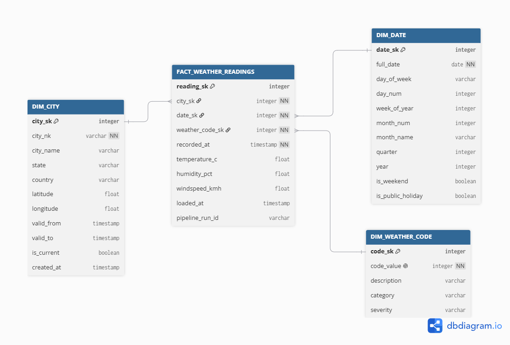
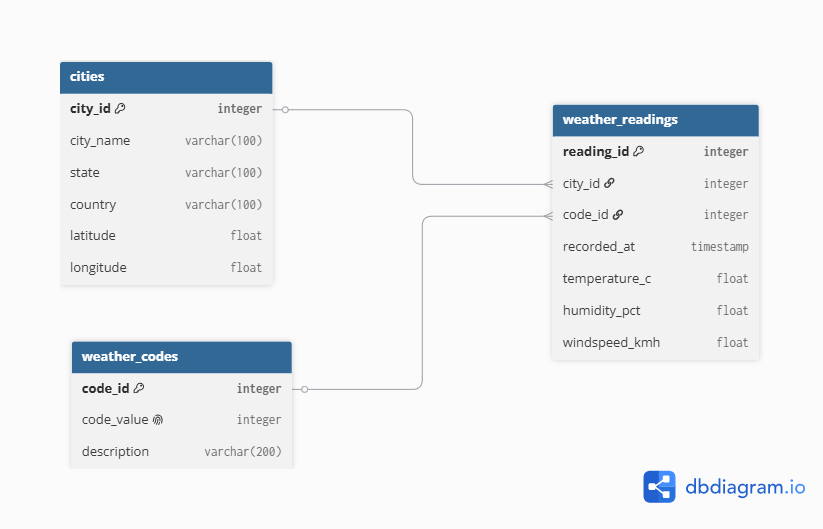
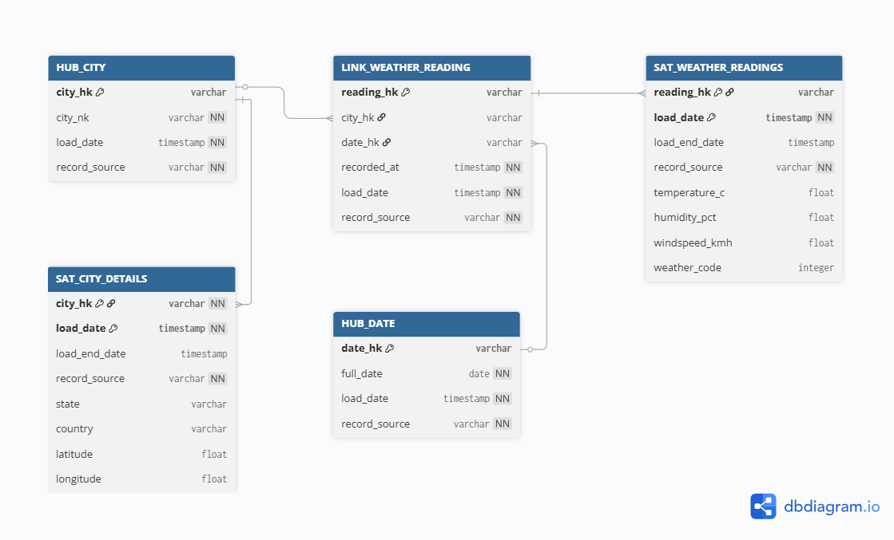
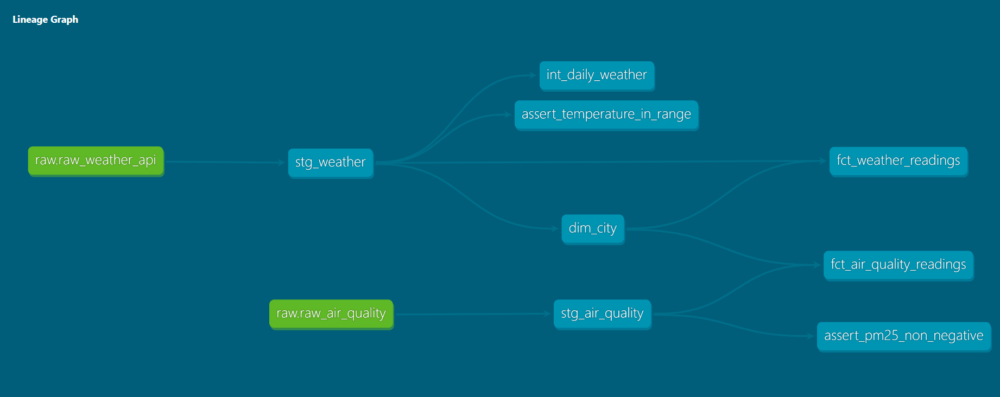

# Weather Intelligence Pipeline

> An end-to-end data engineering pipeline that ingests live weather and air quality data
> for major Indian cities, models it into a Snowflake star schema (with a parallel Data Vault),
> orchestrates the full flow with Apache Airflow, and generates AI-powered summaries using
> the Groq LLaMA API.


---

## Overview

This project pulls hourly weather and air quality data from the free Open-Meteo APIs for
Mumbai, Bangalore, Delhi, and Chennai. The data flows through a layered Snowflake warehouse,
is transformed into an analytics-ready star schema, and is automatically orchestrated by two
Apache Airflow DAGs running on a daily schedule. A Groq-hosted LLM generates a natural-language
intelligence report from the modelled data.

The project demonstrates the full data engineering lifecycle: ingestion, transformation,
dimensional modelling, Data Vault modelling, orchestration, monitoring, and role-based access
control — all built with free tooling and no incurred costs.

---

## Architecture

A visual version of the pipeline architecture:



---

## Data Sources

| Source | API | Metrics | Cost |
|---|---|---|---|
| Weather | Open-Meteo Forecast API | temperature, humidity, wind speed, weather code | Free, no key |
| Air Quality | Open-Meteo Air Quality API | PM2.5, UV index, carbon monoxide | Free, no key |

Cities covered: **Mumbai, Bangalore, Delhi, Chennai**.

---

## Tech Stack

| Layer | Technology |
|---|---|
| Ingestion | Python, `requests`, `tenacity` (retry/backoff) |
| Transformation | pandas |
| Warehouse | Snowflake (Standard edition, key-pair auth) |
| Orchestration | Apache Airflow (TaskFlow API) via Docker Compose |
| AI layer | Groq API -- `llama-3.1-8b-instant` |
| Modelling | Star schema (Kimball) + Data Vault 2.0 |
| Version control | Git + GitHub |

---

## Data Modelling

### Star Schema (Kimball)

The analytics layer follows Kimball dimensional modelling. Two fact tables share **conformed
dimensions**, which enables drill-across analysis between weather and air quality on the same
city and date.

**Fact tables**
- `FACT_WEATHER_READINGS` -- grain: one hourly weather reading per city
- `FACT_AIR_QUALITY_READINGS` -- grain: one hourly air quality reading per city

**Dimensions**
- `DIM_CITY` -- implements **SCD Type 2** (valid_from / valid_to / is_current) to preserve
  history when city attributes change
- `DIM_DATE` -- full calendar dimension (day of week, month, quarter, is_weekend)
- `DIM_WEATHER_CODE` -- WMO weather code descriptions and categories



The raw data was first normalised to 3NF before being denormalised into the star schema.
The normalisation ERD:



### Data Vault 2.0 (parallel model)

A Data Vault model was also built to demonstrate enterprise-grade, audit-friendly modelling.
Hash keys are computed at load time and stamped into every related table, decoupling the
components from one another.

- `HUB_CITY`, `HUB_DATE` -- business keys
- `LINK_WEATHER_READING` -- relationship between city, date, and the reading grain
- `SAT_CITY_DETAILS`, `SAT_WEATHER_READINGS` -- descriptive attributes with load metadata

Every Hub, Link, and Satellite carries `load_date` and `record_source` columns for full
auditability.



Diagrams for both models are in [`/models`](./models).

### Modelling approach

```
RAW (landing) -> Data Vault (audit-friendly history) -> Star Schema (analytics)
```

This hybrid gives both auditability (Data Vault) and query performance (star schema). The
orchestrated pipeline currently loads the star schema; the Data Vault is modelled and
demonstrated, with pipeline-driven loading as the documented next step.

---

## Orchestration (Apache Airflow)

The pipeline is orchestrated with Apache Airflow running locally via Docker Compose. Two DAGs
run on a daily schedule, each handling a separate data source but writing into the same
conformed star schema.

| DAG | Schedule | Flow |
|---|---|---|
| `weather_pipeline_dag` | Daily 7:00 AM IST | API health sensor -> extract -> load raw -> load fact -> AI summary |
| `air_quality_pipeline_dag` | Daily 7:00 AM IST | extract -> load raw -> load fact |

**Key features**
- Built with the **TaskFlow API** for clean, maintainable DAG code
- **Key-pair authentication** to Snowflake (no passwords; the account enforces MFA)
- **Automatic retries** with exponential backoff
- An **HttpSensor** that waits for the source API to be reachable before extraction
- An Airflow **Pool** that throttles concurrent API calls to protect the source
- Credentials stored in Airflow Connections and a mounted `.env` -- never hardcoded in DAGs
- Runs under a least-privilege **`PIPELINE_ROLE`**, not an admin role

---

## Transformation (dbt)

The transformation layer is built with dbt Core, following the modern ELT pattern —
Python extracts and loads raw data, dbt transforms it inside Snowflake using tested,
version-controlled SQL models.

### Data Lineage



### Model layers

| Layer | Models | Materialization |
|---|---|---|
| Staging | stg_weather, stg_air_quality | view |
| Intermediate | int_daily_weather | view |
| Marts | dim_city, fct_weather_readings, fct_air_quality_readings, mart_city_daily_summary | table / incremental |

### Key features

- **Staging layer** deduplicates and cleans raw data (row_number over city + timestamp)
- **Incremental models** with merge strategy for idempotent fact loads
- **Snapshots** implement SCD Type 2 automatically for the city dimension
- **Data tests** — built-in (unique, not_null, relationships) plus dbt_expectations
  (range and row-count assertions)
- **Source freshness** monitoring to detect stalled pipelines
- **Documentation & lineage** — auto-generated catalogue with a full DAG from source to AI report
- **Exposures** document the AI report as a downstream consumer

### dbt + Airflow

dbt runs in an isolated virtualenv inside a custom Airflow Docker image, keeping its
dependencies separate from Airflow's. The ingestion DAG triggers the dbt DAG via
TriggerDagRunOperator, so the full ELT flow is orchestrated end to end.

---

### Snowflake-native scheduling

Beyond Airflow, the project also demonstrates **Snowflake Tasks** and **Streams** for
warehouse-native incremental processing -- chained tasks via `AFTER`, and a Stream + Task
pattern that only consumes credits when new data exists
(`WHEN SYSTEM$STREAM_HAS_DATA(...)`). See [`sql/analytics/`](./sql/analytics).

---

## Project Structure

```
snowflake-weather-pipeline/
|-- src/
|   |-- extract.py                 # weather extract from Open-Meteo
|   |-- extract_air_quality.py     # air quality extract
|   |-- transform.py               # pandas cleaning + typing
|   |-- load.py                    # weather load orchestration
|   |-- load_air_quality.py        # air quality load orchestration
|   |-- snowflake_client.py        # key-pair connection + helpers (Docker/local aware)
|   |-- groq_client.py             # Groq API wrapper
|   |-- ai_summary.py              # generate_full_report() -- AI intelligence report
|   `-- main.py                    # single-command local pipeline run
|-- sql/
|   |-- ddl/                       # table creation (raw, dims, facts, air quality, vault)
|   `-- analytics/                 # window functions, CTEs, joins, aggregations, MERGE,
|                                  #   drill-across, snowflake tasks, stream patterns
|-- airflow/
|   |-- dags/
|   |   |-- weather_pipeline_dag.py
|   |   |-- air_quality_pipeline_dag.py
|   |   `-- learning/              # demo DAGs from the learning process (.airflowignore'd)
|   |-- docker-compose.yaml        # Airflow stack definition
|   `-- requirements-airflow.txt   # provider packages for the Airflow image
|-- dbt/
|   `-- weather_dbt/               # dbt project scaffold (transformations begin next phase)
|-- models/                        # star schema + data vault diagrams (PNG)
|-- docs/                          # architecture diagram, AI output, design + review notes
|-- config/                        # .env + RSA keys (gitignored)
|-- requirements.txt
|-- LICENSE
`-- README.md
```

---

## Setup Instructions

### Prerequisites
- Python 3.11+
- A Snowflake account (free trial)
- A Groq API key (free at console.groq.com)
- Docker Desktop (for Airflow)

### 1. Clone and set up the Python environment

```bash
git clone https://github.com/Sheldie1027/snowflake-weather-pipeline.git
cd snowflake-weather-pipeline
python -m venv venv
venv\Scripts\activate            # Windows
pip install -r requirements.txt
```

### 2. Configure credentials

```bash
copy config\.env.example config\.env
```

Fill in your Snowflake account, user, and Groq API key. This project uses **key-pair
authentication** -- generate an RSA key pair, register the public key on your Snowflake user,
and place the private key at `config/rsa_key.pem`.

### 3. Create the Snowflake objects

Run the DDL scripts in `sql/ddl/` in order in a Snowsight worksheet (raw tables -> dimensions
-> facts -> air quality tables -> data vault).

### 4. Run the pipeline locally (without Airflow)

```bash
python src/main.py
```

### 5. Run with Airflow orchestration

1. Ensure Docker Desktop is running
2. From your Airflow project directory, mount this repo's `src/`, `config/`, and
   `airflow/dags/` folders as volumes (see `airflow/docker-compose.yaml`)
3. Start the stack:
   ```bash
   docker compose up airflow-init
   docker compose up -d
   ```
4. Open the Airflow UI at `http://localhost:8080`
5. Add a Snowflake connection (`snowflake_default`) using key-pair auth and `PIPELINE_ROLE`
6. Add an HTTP connection (`open_meteo_api`)
7. Add a Pool (`open_meteo_pool`, 2 slots)
8. Enable and trigger the DAGs

> **Note:** The volume paths in `docker-compose.yaml` are absolute and reflect the original
> development machine. Update them to match your local clone location.

---

## Sample Analytics

The `sql/analytics/` folder contains queries demonstrating:
- Window functions (`ROW_NUMBER`, `RANK`, `LAG`/`LEAD`, rolling and running aggregates)
- CTEs and chained transformations
- Advanced aggregation (`ROLLUP`, `CUBE`, `GROUPING SETS`)
- `MERGE` upserts and soft-delete patterns
- **Drill-across** queries joining weather and air quality via conformed dimensions
- Statistical correlation (`CORR`) between temperature and air quality
- **Date spine** queries to detect missing data / pipeline gaps
- Stream + Task incremental load patterns

Example insight: combining both fact tables surfaces days where high temperature **and**
elevated PM2.5 occurred together -- useful for public health alerting.

---

## Engineering Practices

- **Key-pair authentication** end to end -- no plaintext passwords anywhere
- **Least-privilege RBAC** -- a dedicated `PIPELINE_ROLE` used for all pipeline loads
- **Idempotent, atomic tasks** in Airflow with retries, sensors, and a throttling pool
- **Timezone-aware datetimes** throughout (no deprecated `utcnow()`)
- **Resilient extraction** -- exponential backoff on API calls, graceful per-city failure handling
- Secrets isolated in `.env` and Airflow Connections; never committed

---

## Roadmap

This is an evolving project built over a multi-week data engineering programme.

- [x] **Week 1** -- Snowflake foundations, Python ETL, star schema, SCD2, Groq AI summary
- [x] **Week 2** -- Apache Airflow orchestration, second data source (air quality),
  Data Vault 2.0, Snowflake Tasks & Streams, security hardening
- [ ] **Next** -- dbt for warehouse transformations, data quality testing, and documentation

---

## License

This project is licensed under the MIT License -- see [LICENSE](./LICENSE) for details.
Built for educational and portfolio purposes.
